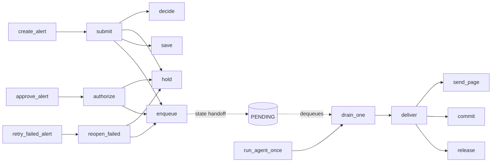

# Reference graph (EVALUATOR ONLY: exclude from ASTERION indexing)

```mermaid
flowchart LR
  CREATE[create_alert] --> SUBMIT[submit]
  SUBMIT --> POLICY[decide]
  SUBMIT --> HOLD[hold]
  SUBMIT --> SAVE[save]
  SUBMIT --> ENQ[enqueue]
  APPROVE[approve_alert] --> AUTH[authorize]
  AUTH --> HOLD
  AUTH --> ENQ
  REOPEN[retry_failed_alert] --> REO[reopen_failed]
  REO --> HOLD
  REO --> ENQ
  ENQ -. state handoff .-> Q[(PENDING)]
  RUN[run_agent_once] --> DRAIN[drain_one]
  Q -. dequeues .-> DRAIN
  DRAIN --> DELIVER[deliver]
  DELIVER --> PAGE[send_page]
  DELIVER --> COMMIT[commit]
  DELIVER --> RELEASE[release]
```

IMPORTANT: dashed handoff arrows represent shared list state, not synchronous CALLS.
