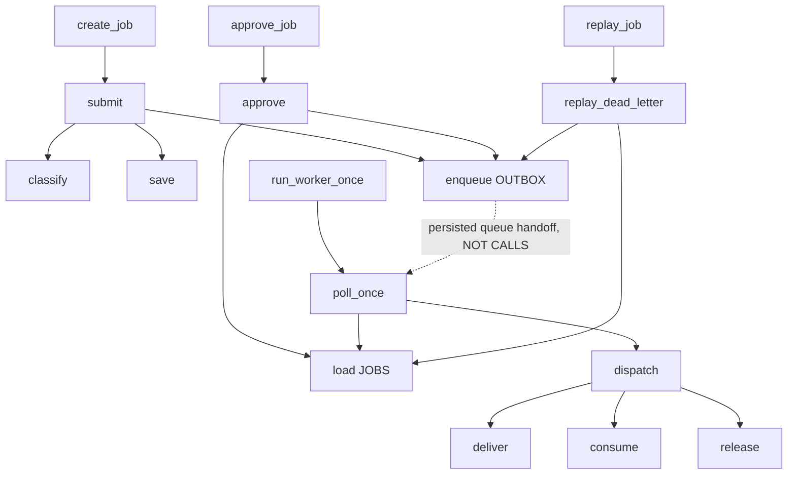

# Graph map (evaluator only; do not index)

```mermaid
flowchart TD
  CJ[create_job] --> S[submit]
  S --> P[classify]
  S --> SV[save]
  S --> ENQ[enqueue OUTBOX]
  AJ[approve_job] --> A[approve]
  A --> L[load JOBS]
  A --> ENQ
  RW[run_worker_once] --> POLL[poll_once]
  POLL --> L
  POLL --> D[dispatch]
  D --> T[deliver]
  D --> C[consume]
  D --> R[release]
  RP[replay_job] --> REPLAY[replay_dead_letter]
  REPLAY --> L
  REPLAY --> ENQ
  ENQ -. persisted queue handoff, NOT CALLS .-> POLL
```
