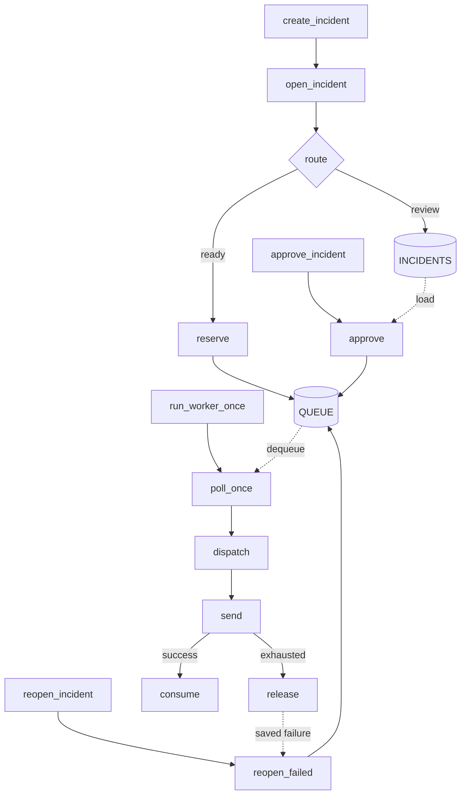

# Conceptual Graph (DO NOT INDEX)

```mermaid
flowchart TD
 A[create_incident] --> B[open_incident]
 B --> C{route}
 C -->|review| D[(INCIDENTS)]
 C -->|ready| E[reserve]
 E --> Q[(QUEUE)]
 F[approve_incident] --> G[approve]
 D -. load .-> G
 G --> Q
 H[reopen_incident] --> I[reopen_failed]
 I --> Q
 J[run_worker_once] --> K[poll_once]
 Q -. dequeue .-> K
 K --> L[dispatch]
 L --> M[send]
 M -->|success| N[consume]
 M -->|exhausted| O[release]
 O -. saved failure .-> I
```
